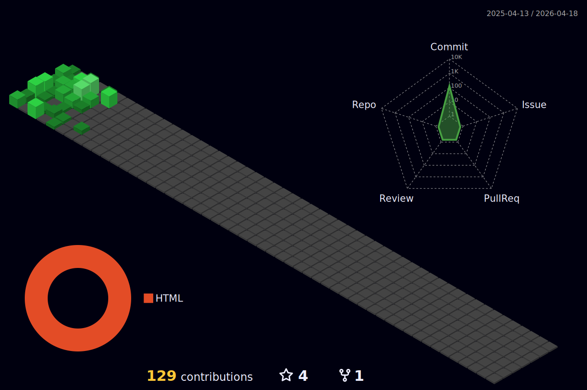

### Hi there 👋

I'm Vlad, a developer living in Kazakhstan. I like simple, clear and efficient code.

```kt
object FlyingV805 {

    const val realname = "Vladislav Petrov"
    const val location = "Kazakhstan"
    val contact = mapOf(
        "Mail" to "petrov.vladislav1992@gmail.com",
        "Twitter" to "@FlyingV805",
        "Telegram" to "@flyingV805"
    )

}
```



## Languages

  


<!--
**flyingV805/flyingV805** is a ✨ _special_ ✨ repository because its `README.md` (this file) appears on your GitHub profile.

Here are some ideas to get you started:

- 🔭 I’m currently working on ...
- 🌱 I’m currently learning ...
- 👯 I’m looking to collaborate on ...
- 🤔 I’m looking for help with ...
- 💬 Ask me about ...
- 📫 How to reach me: ...
- 😄 Pronouns: ...
- ⚡ Fun fact: ...
-->
